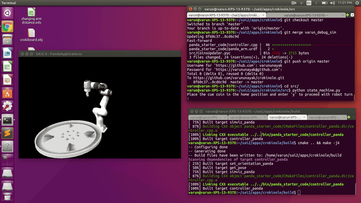

# robot_arm_crokinole

CS225A Course Project Spr '19 (Experimental Robotics), Stanford University.

Control and state machine software for the crokinole project i.e. a 7-DoF torque controllable robot arm.

**Authors**: Angela Cheng, Connie Kang, Lauren Luo and Varun Nayak (MS students at Stanford University)



## Dependencies
1. `cmake` >= 2.8
2. `g++` with `-std >= c++11`
3. SAI2 libraries
    - `sai2-primitives`
    - `sai2-simulation`
    - `sai2-model`
    - `sai2-graphics`
    - `sai2-common`
    - `sai2-urdf`
4. `chai3d`
5. `glfw3`
6. `redis`

## Build Instructions
```
mkdir build && cd build
cmake .. && make -j$(nproc)
```

To run in simulation, set the bool `flag_simulation` to `true` in `panda_interface/controller.cpp`.